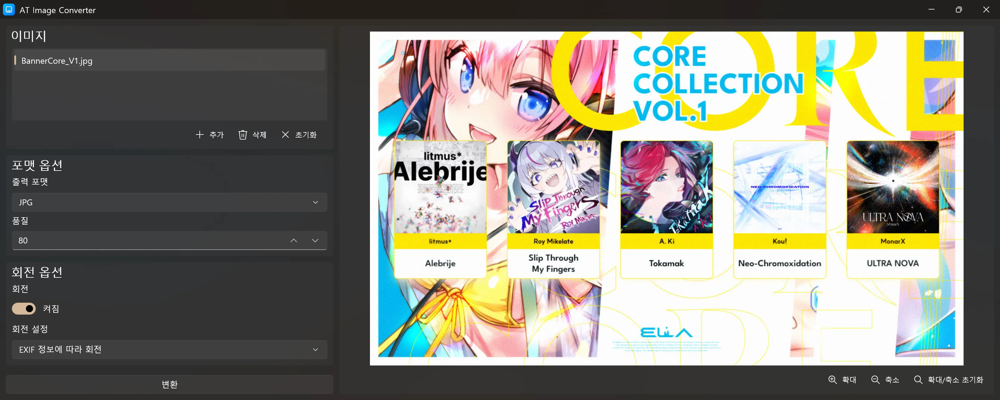
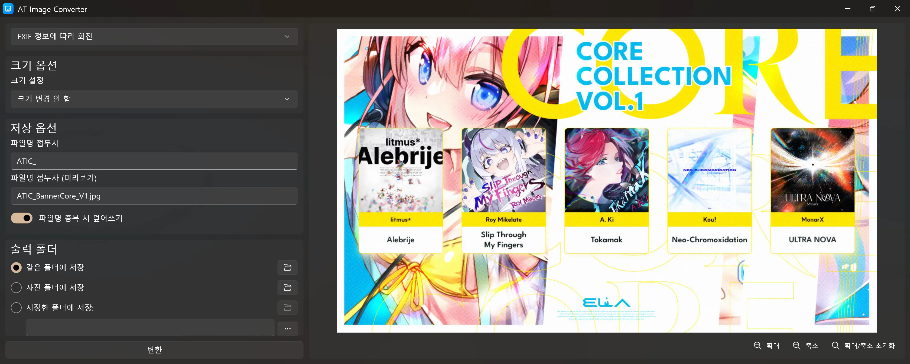
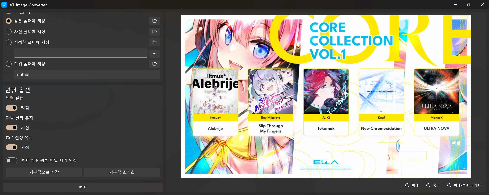
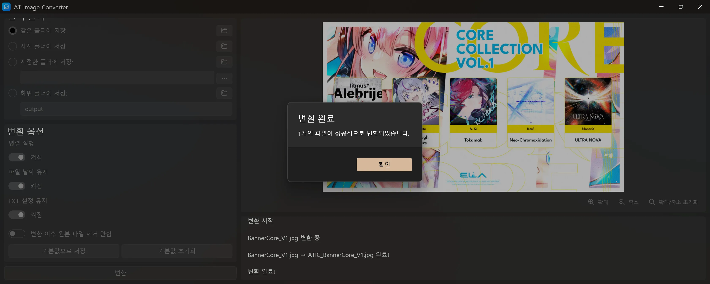

# AT Image Converter

한국어 | **[English](README.md)**

WinUI 3와 Magick.NET 기반의 강력한 일괄 이미지 변환 도구입니다.

## 스크린샷

## 지원 포맷

| 입력 포맷 (16종) | 출력 포맷 (8종) |
|---|---|
| PNG, JPG, JPEG, BMP, GIF, TIFF, ICO, SVG, WEBP, HEIC, HEIF, HEIX, PDF, PSD, XCF, RAW | JPG, JXL, PNG, BMP, WEBP, AVIF, ICO, TIFF |

## 주요 기능

- **일괄 변환** — 여러 이미지를 한 번에 변환
- **병렬 변환**으로 빠른 처리
- **품질 조절** (0–100) — JPG, JXL, WEBP, AVIF, TIFF 지원
- **이미지 회전** — EXIF 자동 회전, 90°/180° 회전
- **크기 조절** — 채우기, 너비 맞춤, 높이 맞춤 (픽셀 또는 % 단위)
- **출력 폴더 선택** — 같은 폴더, 사진 폴더, 지정 폴더, 하위 폴더
- **파일명 접두사 설정** 및 실시간 미리보기
- **파일명 중복 처리** — 덮어쓰기 또는 자동 이름 변경
- **파일 날짜 및 EXIF 데이터 유지** 옵션
- **이미지 미리보기** 및 확대/축소
- **ICO 변환** 시 다중 크기 자동 생성 (16–256px)
- **SVG 입력** 시 투명도 유지
- **설정 저장 및 초기화**
- **Windows 파일 탐색기 우클릭 메뉴** 연동
- **Mica 디자인** 적용

## 라이선스

이 프로젝트는 MIT 라이선스로 배포됩니다.
