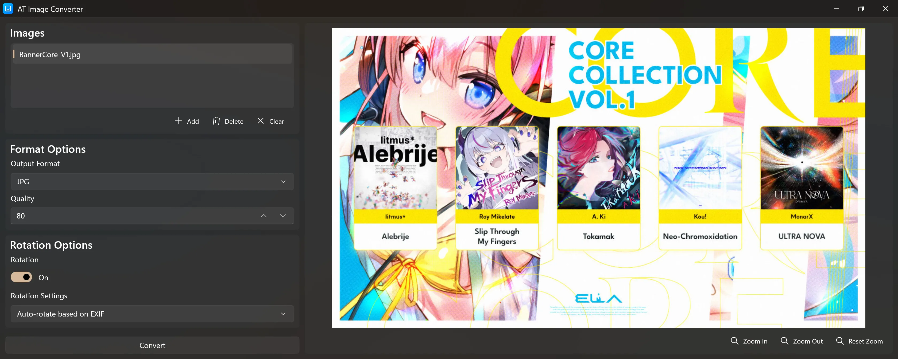
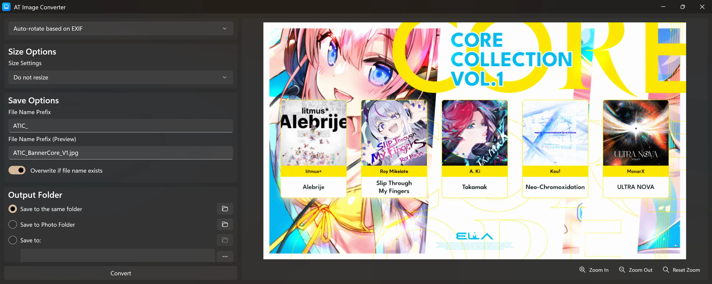
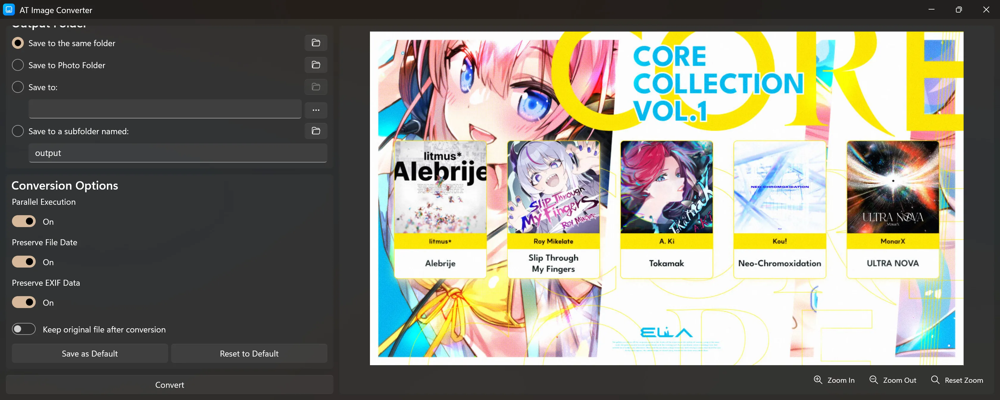
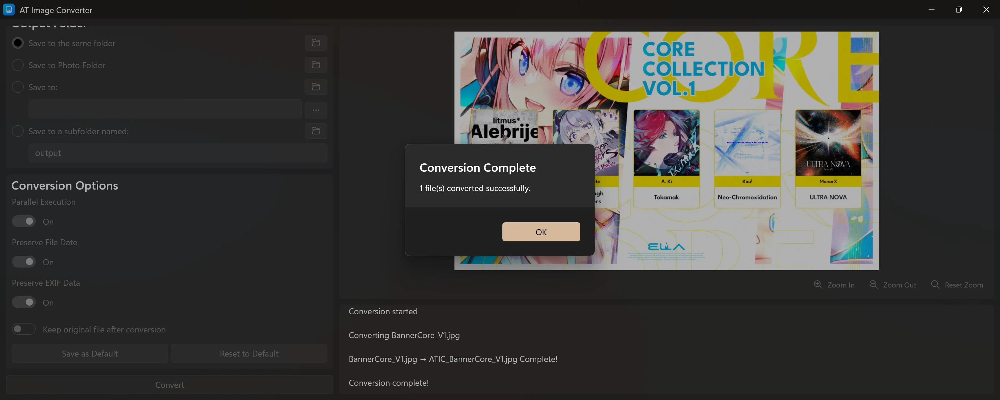

# AT Image Converter

**[한국어](README.ko.md)** | English

A powerful batch image converter built with WinUI 3 and Magick.NET.

## Screenshots

## Supported Formats

| Input Formats (16) | Output Formats (8) |
|---|---|
| PNG, JPG, JPEG, BMP, GIF, TIFF, ICO, SVG, WEBP, HEIC, HEIF, HEIX, PDF, PSD, XCF, RAW | JPG, JXL, PNG, BMP, WEBP, AVIF, ICO, TIFF |

## Features

- **Batch conversion** — convert multiple images at once
- **Parallel conversion** for faster processing
- **Quality control** (0–100) for JPG, JXL, WEBP, AVIF, TIFF
- **Image rotation** — auto-rotate by EXIF, 90°/180° rotation
- **Resize options** — fill, fit to width, fit to height (px or %)
- **Output folder selection** — same folder, photo folder, custom folder, or subfolder
- **Custom filename prefix** with real-time preview
- **Duplicate file handling** — overwrite or auto-rename
- **Preserve file dates and EXIF data** options
- **Image preview** with zoom in/out
- **ICO export** with automatic multi-size generation (16–256px)
- **SVG input** with transparency support
- **Save/reset default settings**
- **Windows File Explorer context menu** integration
- **Modern Mica design**

## License

This project is licensed under the terms of the MIT License.
